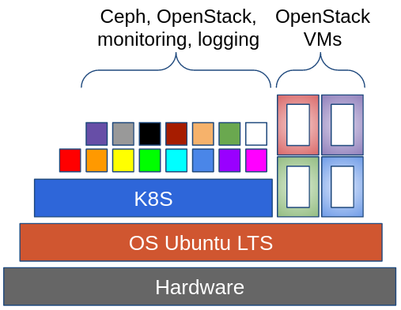
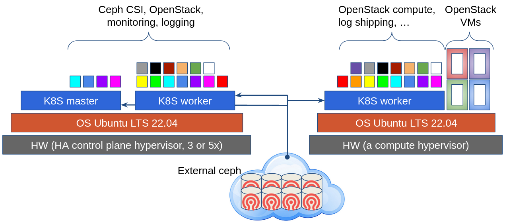
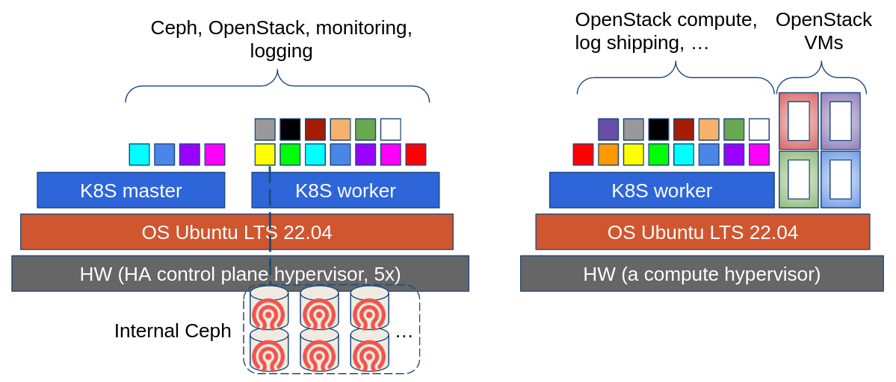

# Beskar cloud architecture

Beskar cloud stands for OpenStack (IaaS) and Kubernernetes (CaaS) clouds with distributed (ceph) storage in one solution.

## Architecture overview

Each cloud node has installed and cloud configured Ubuntu LTS 22.04 operating system (via [infra-config](https://github.com/beskar-cloud/infra-config)).
On top of configured operating system vanilla kubernetes is installed (via [Kubespray](https://github.com/kubernetes-sigs/kubespray) and configuration persisted in [kubernetes-deployments repository](https://github.com/beskar-cloud/kubernetes-deployments)).
OpenStack components, monitoring, proxies, log shipping and alternatively ceph distributed storage is deployed into kubernetes via [Flux CD](https://fluxcd.io/).

Looking more in detail we distinguish three different types of cloud nodes:
 * controlplane nodes
 * compute nodes
 * storage nodes

As shown below all cloud services requiring high availability and resiliency are placed on 3 or 5 controlplane nodes. There are few necessary components on each compute nodes providing OpenStack IaaS services (software defined networking and server virtualization).

Distributed (ceph) storage is used on one side as distributed storage for Kubernetes and also on other hand as backing storage for OpenStack components (Glance, Cinder, Libvirt, Swift/Rados Gateway). Distributed storage may be consumed from external service or could be part of cloud infrastructure as shows next picture.

Kubernetes master and worker subparts of controlplane nodes could be deployed directly on hypervisor or isolated as VMs there which comes with a performance penalty but significantly simplifies controlplane hypervisor maintenance.

Learn more about [Beskar cloud repositories](repositories.md).

## Recommended HW specification

Typical production Beskar cloud HW hypervisors specification:
 * 48+ cores
 * 512+ GB RAM
 * 2 NVME disks in RAID for operating system (480+ GB)
 * 1-2 NVME disks for ephemeral data (used in OpenStack for VM with ephemeral disk)
 * multiple network interfaces (see [OpenStack](https://docs.openstack.org/nova/latest/install/overview.html#example-architecture) and [ceph](https://docs.ceph.com/en/latest/rados/configuration/network-config-ref/) recoomendations)
   * 2x (LACP) VM data VLAN, 10+Gbps
   * 2x (LACP) distributed storage client VLAN, 10+Gbps
   * 1x controlplane/management VLAN, 1+Gbps
   * if distributed storage is part of cloud: 2x (LACP) distributed storage cluster (replication) VLAN, 10+Gbps
 * redundant power supply
 * distributed ceph storage of at least 100TB
   * dedicated ceph pools for Kubernetes persistent volumes
   * dedicated pools for Openstack components and user VMs (Glance images, Cinder volumes, Swift/Rados Gateway object storage, OpenStack VMs)

## Minimal configuration

Minimal testing cloud infrastructure could consist of:
 * VMs with 8 vCPUs, 16 GB RAM and 100GB disk
   * 1 or 3 virtual servers for controlplane
   * at least 2 virtual servers for compute with enabled nested virtualization
 * connected external distributed (ceph) storage or internal ceph cluster on additional disks on controlplane VMs

## Quality assurance
* Deployment of Beskar cloud brings matured cyber-security level as proved by excellent results of penetration tests run by CESNET Forensic Laboratory. 

## Used technologies
 * Kubernetes (Kubespray)
 * kube-vip
 * OpenStack
 * Prometheus monitoring (Prometheus, Pushgateway, Alertmanager, various prometheus exporters)
 * Grafana
 * Grafana Loki
 * edge proxy (Traefik / Nginx)
 * Identity servers (Oauth2-proxy to , OpenLDAP, ...),
 * Distributed storage (Ceph, Rook-ceph)
 * Flux CD
 * Weave gitops server
 * Ansible
